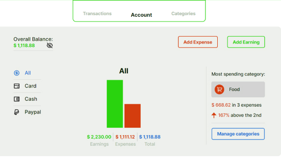
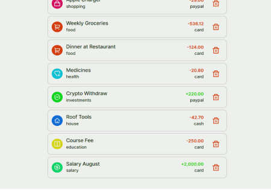
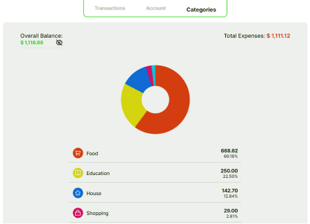

# The Safe



This project was created by Andre Mendonca © - All rights reserved.

## What The Safe is?
The Safe is a project created for people who wants to track and be in a better control of their financial life. The project works as a browser application that could easily be adapted for smartphones and tablets.

Using The Safe, the user has the possibility to **add expenses** they had or **earnings** they have got and link these transactions to a payment/receiving method that could be their bank card, cash amount or paypal account and agroup each transaction in a variety of specific categories. Moreover, due to a clear, straightforward and organic layout and design, the user can create a transaction in just a few seconds, with no space for questions.



## Technologies Used

To build this application, I generaly used **React JS**. Reactive States were the foundation of the app, regarding that all the data that is shown on the pages is reactive and affected by Effect Hooks. In addition, a **Global Context** was used to get variables and data across multiple files and components.

When it comes to stylization, I used **CSS Modules** for each JSX Component in order to increase the acessibility and help on the maintenance of the site.

## Other Functionalities

Beyond showing the user's earnings and expenses and an Overall Balance, I decided to go a step forward and create two other pages that increase the number of information and details the user can have access to.

The **Transactions Page** allows the user to check all the transactions they have made and also to delete the ones they found unecessary or incorrect. A method filter can be applied to show a more specific report.

The **Categories Page** has a clear focus on the separation of expenses per category, enabling the user to analyze the categories they have spent the most and their percentages. It also has a total reactive pie graphic.




## Alternative Database

In a real application, this project would be built with a database integrated in order to save the user's data in a safe and global storage. However, I decided to use the browser's Local Storage to keep all the information necessary to run the app, which allows the user to continue their progress by just opening the site on the same browser as before.

All the data is saved at the key ```database``` on the ```window.localStorage``` that has as value a JSON format file in a string.
